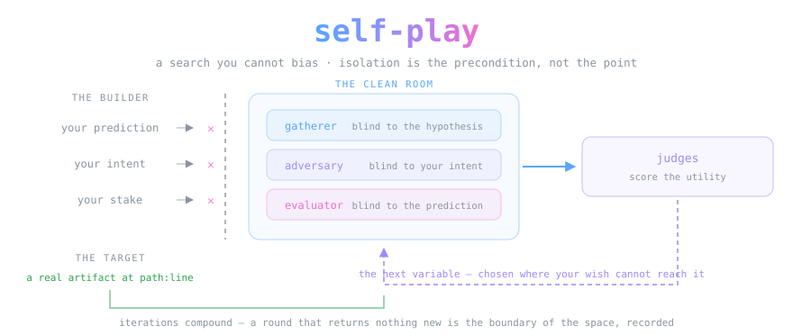
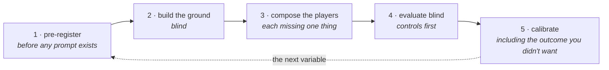

<div align="center">



*A search you cannot bias. Isolation is the precondition, not the point.*

[](LICENSE.md)


</div>

> **A search method, not a checkup.** This repository ships one Claude Code
> skill that explores a problem space you have not solved yet — you put up a
> candidate design, isolated sub-agent players attack it, feed it and score it,
> and each iteration names the variable the next one should vary. It works like
> AlphaGo's mechanism, over text rather than board positions: the machine plays
> the space against itself, and judges determine the utility of what comes back.

> [!IMPORTANT]
> **Isolation is what makes the output evidence.** A builder evaluating their own
> LLM feature returns their own prior with apparatus around it, and it reads as
> rigor the whole way down. So each player is blind to exactly the thing that
> would let it serve the builder's wish: a gatherer that does not know the
> hypothesis cannot curate toward it, an evaluator that never sees the prediction
> cannot mark an answer sheet, an adversary that never sees the intent cannot
> perform to it. Everything else in the skill serves that one property, because
> without it the search is a mirror.

## Why it is called self-play

The name is the mechanism. From the design brief:

> Our self-play skill is used to explore problem-spaces we haven't solved yet.
> It operates like the AlphaGo mechanism, but over text, letting the AI guide
> variable selection over multiple tests. It doesn't breed ignorance. It
> provides an unbiased clean-room for novel exploration. The judges then
> determine the utility of the result. Iterations improve over time.
>
> — Matthew Murphy

A clean room is not the goal. It is what you build so the search returns
something you did not already believe.

## The five moves

One **iteration** of the search. The order is not cosmetic — each move closes a
leak the previous one opened.



Invariant: these five moves and the isolation each protects. Free: the domain,
the ground, the players' selections, and the metric. Swap those and the same
skeleton searches a water-chemistry claim, a comedy corpus, a codebase, or a
flat-Earth argument.

## 🛠️ Using it

```bash
git clone https://github.com/OpenCnid/self-play.git
mkdir -p ~/.claude/skills
cp -r self-play/skills/self-play ~/.claude/skills/
```

**Do not skip the `mkdir`.** If `~/.claude/skills/` does not already exist, `cp`
reads the trailing path as a *rename target*: you get `~/.claude/skills/SKILL.md`
with no skill directory, exit code 0, and no error. The skill never loads and
nothing tells you why.

PowerShell:

```powershell
git clone https://github.com/OpenCnid/self-play.git
New-Item -ItemType Directory -Force ~/.claude/skills
Copy-Item -Recurse -Force self-play/skills/self-play ~/.claude/skills/
```

`-Force` matters on the second run — without it, an upgrade fails with *an item
with the specified name already exists*.

If you have set `CLAUDE_CONFIG_DIR`, that is your skills root, not `~/.claude`.

Then say *"is this rubric actually doing anything"*, *"red-team this design"*,
*"explore this design space"*, or *"validate this without fooling myself"* and it
triggers on its own. It also fires on the question worth asking first — **whether
the clean room is worth building at all** — which it answers "no" whenever a
deterministic check would settle the matter.

> [!NOTE]
> The skill names five sibling skills. Pinned copies of all of them are vendored
> under [`vendor/`](vendor/) with provenance and hashes in
> [`docs/DEPENDENCIES.md`](docs/DEPENDENCIES.md). Two of them —
> `prompt-engineering` and `hypershot-protocol` — are a **hard** requirement for
> authoring player prompts, under an OpenCnid convention called the
> authoring gate.
> The rest degrade gracefully; [`docs/INTERFACE.md`](docs/INTERFACE.md) says
> exactly how.

## What running the method established

Four runs against unrelated targets, written up with their addresses in
**[docs/FINDINGS.md](docs/FINDINGS.md)**. The short version:

| run | what it returned |
|---|---|
| a **design keystone** under adversarial attack | fell on three attacks the composer never predicted — and the one attack the composer *did* predict was withdrawn on audit, taking the self-scored calibration from 1-for-4 to **0-for-4** |
| an **external fact corpus** | a blind evaluator rejected **13 of 14** flat-earth arguments against a fact base built by gatherers who were never told a dispute existed |
| a **codebase audit** | found real defects, then **withdrew or narrowed three of its own six findings** in the same session — and the correction to one withdrawal committed the same error it was correcting |
| a **composition ceremony** | both pre-committed falsifying cells came back empty, and the builder's prediction was wrong in the direction the builder wanted |

## 🔬 Audit the clean room yourself

Isolation is a claim about the sub-agent boundary, and a channel nobody audits
is exactly the leak the method cannot see. The harness is checked in:

```bash
bash probes/run-probes.sh
```

It plants unguessable canaries in a skill body and a `CLAUDE.md`, runs five arms
— including a positive control that should show the instrument can see, and a
negative control that should show a recovered canary was the file rather than a
guess — prints each arm's output beside a table of expected values, and cleans up
after itself. Method in **[probes/README.md](probes/README.md)**.

**The harness computes no verdict.** It prints what each arm returned and what a
matching version should return; reading the two against each other is yours.
Treating a printed expectation as a result would be exactly the failure the rest
of this repository is about.

One run is recorded in **[probes/RESULTS.md](probes/RESULTS.md)** (Claude Code
2.1.214, 2026-07-31). Both controls behaved and every arm matched, which
establishes the thing this skill most needs to be true and most needs you to
know is *not* entirely true:

> **Project `CLAUDE.md` crosses into every player.** A hypothesis written there
> reaches every seat without anyone putting it in a prompt. Skills loaded by the
> *composer* do not cross — that half of the isolation ledger held — but
> `CLAUDE.md` does, so a self-play run audits it alongside the player prompts.

## 🏔️ Standing on the shoulders of giants

The composition discipline here is not ours. It is the **Lexideck prompt
engineering curriculum** by **[Matthew Murphy](https://github.com/gusthemole)** —
the structural-clarity toolkit (semantic tagging, hierarchical markers,
structured placeholders, collections, attention management) and the
**hypershot**: priming structure without priming content, using frames with free
variables instead of contaminating few-shot examples. Every frame in this
repository is a hypershot, and the framing of self-play as an AlphaGo-shaped
search over text is his.

## Honest notes

- **The value of the ceremony is argued, not measured.** No run here compares a
  self-play search against an unstructured review, because that comparison holds
  a null arm and its outcome is entailed by what an instruction is. What the
  record actually contains is cases where the method returned an answer against
  the person who wanted it to work.
- **Four runs is four runs.** One program, one house, days apart — and two of the
  four are sections of a single source document. The frame's
  domain-independence is evidenced by the spread of targets, not proven.
- **The blinding does not cover the write-up.** Gathering, attacking and
  item-scoring were blind. The final report was written by the person who wanted
  the result, and this README is that person's summary of it.
- **A skill that tells you not to use it is working.** If a deterministic check
  answers the question, the clean room is theater. Most questions do not need
  one.
- **The withdrawals cut both ways.** A method that has never returned a finding
  against its builder has not been tested; this one did. But the same bytes
  support a less flattering reading: three of the codebase audit's six findings
  did not survive their own session, which is a **50% initial false-finding
  rate**, in prose as fluent as the findings that held. A frame where every
  outcome confirms the method is not evidence, so both readings are published.
- **This repository failed its own pre-committed test once.** A cold reader could
  not execute one iteration without hitting questions it answers nowhere. What
  was fixed and what was not is in [docs/VALIDATION.md](docs/VALIDATION.md).
- **A human and an AI built this together.** We disclose this because OpenCnid
  discloses this.

## Layout

```
skills/self-play/           the skill — clone, copy, say "red-team this design"
  references/               material pulled out of the body to keep it loadable
docs/FINDINGS.md            what four runs of the method established, with addresses
docs/DEPENDENCIES.md        each dependency, its pin, and what breaks without it
docs/INTERFACE.md           what a host supplies, what a caller passes and receives
docs/RUNBOOK.md             the five moves at operational depth
docs/VALIDATION.md          the clean-room test of this rebuild, including what it missed
probes/                     the channel audit — is the clean room actually sealed?
vendor/                     pinned copies of every skill this one names
AGENTS.md                   the agents' front door
```

## License

Prose and skill: [CC BY 4.0](LICENSE.md) © OpenCnid Labs. The prompt-engineering
and hypershot techniques, and the self-play framing itself, are Matthew Murphy's
work, credited above — go read the source.

---

<div align="center">
<sub>No player was told what its looking would turn up in the making of this repository.</sub>
</div>
